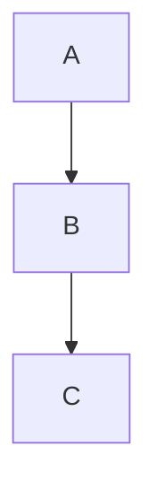
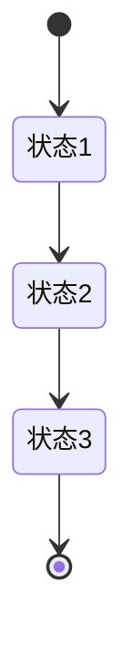

# Markdown语法指南

## 基本语法

### 标题
```markdown
# 一级标题
## 二级标题
### 三级标题
#### 四级标题
##### 五级标题
###### 六级标题
```

### 列表
```markdown
- 无序列表
1. 有序列表
```

### 链接
```markdown
[链接文本](链接地址)
```

### 图片
```markdown

```

### 粗体和斜体
```markdown
**粗体**
*斜体*
```

### 代码块
```markdown
`代码`
```

### 表格
```markdown
| 表头1 | 表头2 | 表头3 |
| ----- | ----- | ----- |
| 单元格1 | 单元格2 | 单元格3 |
| 单元格4 | 单元格5 | 单元格6 |
```

### 分割线
```markdown
---
```

### 引用
```markdown
> 引用文本
```

### 转义字符
```markdown
\* 星号
\_ 下划线
\` 反引号
\# 井号
```

## 高级语法

### 任务列表
```markdown
- [x] 已完成任务
- [ ] 未完成任务
```

### 数学公式
```markdown
$数学公式$
```

### 流程图
```markdown


### 甘特图
```markdown
```mermaid
gantt
    dateFormat  YYYY-MM-DD
    title 甘特图示例

    section 任务
    任务1           :a1, 2023-04-01, 30d
    任务2           :after a1  , 20d
    任务3           : 24, 4d
```

### 状态图
```markdown
