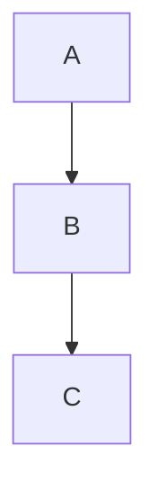

# baopegknowledge_LOG
> 标签使用规定：
> 1. `#`开头，为整个markdown的标题。
> 2. `##`开头，为每日的学习笔记。[ ] 说明了学习内容 
> 3. `###`开头，为每日的学习笔记的子标题，将会概括一种知识的总称，以后若有补充，也会在这个标题下面。
> 4. `####`开头，为此类知识每一个知识点。

---
## 2025-04-10
- [x] 学习Git
- [x] 学习Markdown


### Git使用大全

#### 安装与配置

1. 下载安装git
- 从官网下载所需要的git版本。[https://git-scm.com/downloads](https://git-scm.com/downloads)。
 - 使用相应的命令行工具安装git([windows](https://git-scm.com/downloads/win),[macos](https://git-scm.com/downloads/mac),[linux](https://git-scm.com/downloads/linux))

- 安装完成后，使用`git --version`命令查看git版本号，确认git是否安装成功。

2. 配置git
```bash
# 配置用户名
git config --global user.name "Your Name"

# 配置用户邮箱
git config --global user.email "配置用户名"

# 查看配置信息
git config --list
```

#### 基础操作

1. 创建和初始化仓库
`git init`

2. 克隆仓库
`git clone <repository-url>`

3. 添加文件
```bash
# 添加单个文件
git add <file>

# 添加多个文件
git add <file1> <file2>

# 添加所有文件
git add .
```

4. 提交修改
```bash
# 提交修改
git commit -m "提交信息"

# 提交修改,并添加所有修改的文件(跳过git add步骤)
git commit -a -m "提交信息"
```

5. 查看状态
`git status`

6. 查看修改
`git diff`

7. 撤销修改
```bash
# 撤销对文件的修改
git checkout -- <file>

# 撤销对所有文件的修改
git checkout .
```

8. 删除文件
```bash
# 删除文件
git rm <file>

# 删除文件并提交
git rm -f <file>
```

9. 远程仓库
```bash
# 添加远程仓库，name是远程仓库的名称，url是远程仓库的地址，url可使用https、git、ssh等协议。
git remote add <name> <url>

# 查看远程仓库
git remote -v

# 修改远程仓库地址，name是远程仓库的名称，url是远程仓库的地址
git remote set-url <name> <url>

# 删除远程仓库
git remote rm <name>
```

10. 分支管理
```bash
# 创建分支
git branch <branch-name>

# 切换分支
git checkout <branch-name>

# 合并分支
git merge <branch-name>

# 删除分支
git branch -d <branch-name>
```
11. 解决冲突
```bash
# 解决冲突
git mergetool

# 提交解决冲突的修改
git commit -m "解决冲突"
```

12. 推送和拉取
```bash
# 推送本地分支到远程仓库
git push <remote> <branch>

# 拉取远程分支到本地
git pull <remote> <branch>
```

13.查看信息
```bash
# 查看日志
git log

# 查看差异
git diff

# 查看文件内容
git show <file>

# 查看提交历史
git reflog

# 查看分支历史
git branch --verbose

# 查看标签历史
git tag
```

#### 使用情景

1. 多人协作
```bash
# 拉取远程分支到本地
git pull <remote> <branch>

# 解决冲突
git mergetool

# 提交解决冲突的修改
git commit -m "解决冲突"

# 推送本地分支到远程仓库
git push <remote> <branch>
```

2. 分支管理
```bash
# 创建分支
git branch <branch-name>

# 切换分支
git checkout <branch-name>

# 合并分支
git merge <branch-name>

# 删除分支
git branch -d <branch-name>
```

3. 版本回退
```bash
# 查看提交历史
git reflog

# 回退到指定版本
git reset --hard <commit-id>
```

### markdown使用大全

#### 基本语法

1. 标题
```markdown
# 一级标题
## 二级标题
### 三级标题
#### 四级标题
##### 五级标题
###### 六级标题
```
# 一级标题
## 二级标题
### 三级标题
#### 四级标题
##### 五级标题
###### 六级标题

2. 列表
```markdown
- 无序列表
1. 有序列表
```
- 无序列表
1. 有序列表

3. 链接
```markdown
[链接文本](链接地址)
```
[链接文本](链接地址)

4. 图片
```markdown

```


5. 粗体和斜体
```markdown
**粗体**
*斜体*
```
**粗体**
*斜体*

6. 代码块
```markdown
`代码`
```
`代码`

7. 表格
```markdown
| 表头1 | 表头2 | 表头3 |
| ----- | ----- | ----- |
| 单元格1 | 单元格2 | 单元格3 |
| 单元格4 | 单元格5 | 单元格6 |
```
| 表头1 | 表头2 | 表头3 |
| ----- | ----- | ----- |
| 单元格1 | 单元格2 | 单元格3 |
| 单元格4 | 单元格5 | 单元格6 |

8. 分割线
```markdown
---
```
---

9. 引用
```markdown
> 引用文本
```
> 引用文本
10. 转义字符
```markdown
\* 星号
\_ 下划线
\` 反引号
\# 井号
```
\* 星号
\_ 下划线
\` 反引号
\# 井号

#### 高级语法

1. 任务列表
```markdown
- [x] 已完成任务
- [ ] 未完成任务
```
- [x] 已完成任务
- [ ] 未完成任务

2. 数学公式
```markdown
$数学公式$
```
$数学公式$
$y=kx+b$

3. 流程图
```markdown


4. 甘特图
```markdown
```mermaid
gantt
    dateFormat  YYYY-MM-DD
    title 甘特图示例

    section 任务
    任务1           :a1, 2023-04-01, 30d
    任务2           :after a1  , 20d
    任务3           : 24, 4d
```

5. 状态图
```markdown
